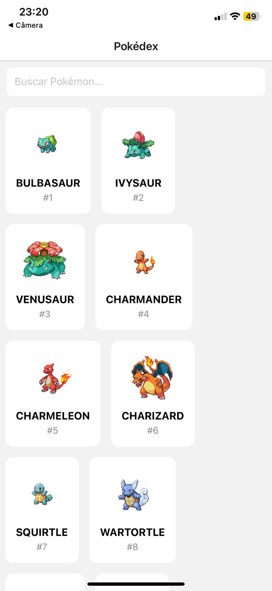
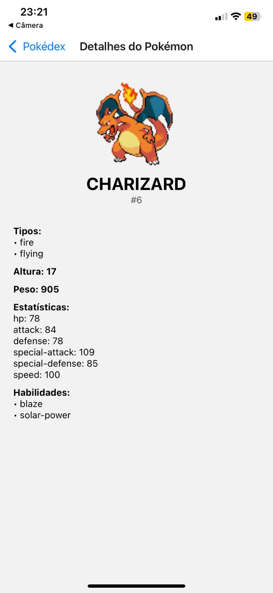
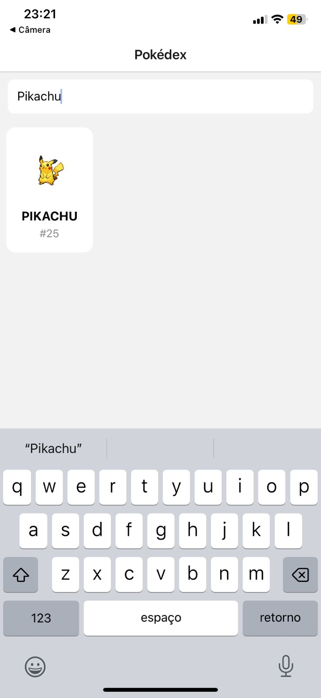

# 📱 Pokédex Digital — Trabalho Final de React Native

Este projeto é uma **Pokédex Digital completa**, desenvolvida em **React Native com Expo**, utilizando a **PokéAPI** para listar, buscar e exibir detalhes de qualquer Pokémon.

---

## 📌 Descrição do Projeto
O aplicativo permite:
- Listar Pokémons com imagens
- Buscar Pokémons pelo nome
- Ver detalhes completos
- Scroll infinito
- Navegação entre telas

---

## ✔️ Funcionalidades Implementadas
- Lista paginada de Pokémons  
- Busca por nome  
- Tela de detalhes (tipos, stats, peso, altura, habilidades)  
- Navegação com React Navigation  

---

## 🛠 Tecnologias Utilizadas
- React Native  
- Expo  
- React Navigation  
- PokéAPI  
- JavaScript  

---

## 📦 Instalação

### 1️⃣ Instalar dependências
```
npm install
```

### 2️⃣ Instalar navegação
```
npm install @react-navigation/native
npm install @react-navigation/native-stack
npm install react-native-screens react-native-safe-area-context
```

---

## ▶️ Executar o Projeto
```
npx expo start
```

Rodar na Web:
```
npx expo start --web
```

---

## 🖼 Screenshots

### 📌 Tela Inicial  


### 📌 Tela de Detalhes  


### 📌 Tela de Busca  


> Coloque suas imagens na pasta **screenshots/** e mantenha esses nomes.

---

## 👨‍💻 Autor
Projeto desenvolvido por **Marcondes**.

